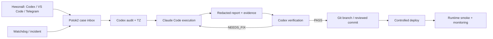

# AI-офис — целевая архитектура (to-be)

## 1. Каноны

| Тип данных | Источник истины | Куда копируется | Что запрещено |
|---|---|---|---|
| Код, конфиги без секретов, архитектура | приватный GitHub | локальный и удалённый Mac, controlled deploy | прямой runtime→main sync |
| Знания и рабочие заметки | отдельный приватный Obsidian-vault repo | Obsidian на разрешённых устройствах | health/secrets/raw transcripts |
| Runtime state, БД, логи | конкретный runtime | backup + off-site | GitHub и Obsidian |
| Секреты | secret store/env конкретного контура | encrypted backup по отдельной политике | Markdown, git, отчёты |
| Задачи и evidence | Potok2 case store + redacted reports | dashboard, `_agent_reports/` | полные приватные данные |

## 2. Роли

- Николай — владелец и финальное подтверждение значимых изменений.
- Codex — архитектор, triage, аудит, ТЗ и независимая приёмка.
- Claude Code в VS Code — исполнитель утверждённых изменений.
- OpenClaw AI-директор — наблюдение, бизнес-оркестрация и постановка задач.
- Sub-агенты — узкие исполнители с минимальными инструментами и отдельными
  workspaces.
- Watchdog — независимый монитор control plane и runtime.

## 3. Поток задачи

## 4. Синхронизация

### GitHub

- Работа ведётся в ветке/задаче, а не прямой записью в `main`.
- Исполнитель создаёт diff и evidence; reviewer подтверждает результат.
- Push/merge остаётся отдельным подтверждаемым действием.
- Удалённый и локальный Mac используют один git-канон, но не редактируют один
  worktree одновременно.

### Obsidian

- Для общего второго мозга используется отдельный приватный vault repository.
- Автосинхронизация раз в пять минут допустима только для этого vault.
- Один файл имеет одного writer в конкретный момент.
- Конфликты не разрешаются автоматическим перезаписыванием.
- Health, секреты, БД и runtime-логи исключаются до первого commit.

### Runtime

- Runtime получает только allowlisted deployable artifacts.
- Перед deploy: plan → provenance/drift gate → backup → atomic replace →
  artifact-specific smoke → отчёт.
- `remote_ahead/diverged` блокирует deploy до ручного capture/review.
- Живые данные идут только в backup/off-site, не обратно в git.

## 5. Агент или sub-агент

Sub-агент подходит, если совпадают владелец, trust boundary, runtime и набор
данных. Отдельный агент/контейнер обязателен, если отличается хотя бы одно:

- публичные пользователи;
- Telegram/MAX token;
- медицинские или семейные данные;
- разрешённые инструменты;
- бюджет/провайдер;
- правила retention;
- blast radius при компрометации.

Поэтому внутренние Content/Analytics/Research роли могут быть sub-агентами
директора, а Father-MAX, Аптечка и публичный Sales Rep остаются отдельными
контурами.

## 6. Удалённый Mac

Удалённый Mac становится постоянно включённым control plane:

- Potok2 runner и watchdog;
- отдельные worktree на задачу;
- клон приватных репозиториев;
- обработка очереди без зависимости от локального Mac;
- encrypted backup runtime-state Potok2;
- Tailscale/SSH с минимальными правами.

Локальный Mac остаётся удобным интерфейсом для голоса, VS Code и ручного
контроля, но его выключение не останавливает очередь и мониторинг.

## 7. Порядок миграции

1. Завершить реестр проектов, данных, writers и backup.
2. Свести `_agent_flow` и Potok2: reuse действующих частей, убрать дублирование.
3. Создать отдельный private repo для control plane.
4. Поднять Potok2 локально и пройти end-to-end smoke.
5. Развернуть на удалённом Mac.
6. Подключить Obsidian sync только после secret/data classification.
7. Подключать по одному runtime через controlled deploy.
8. Провести reboot и restore drill.

